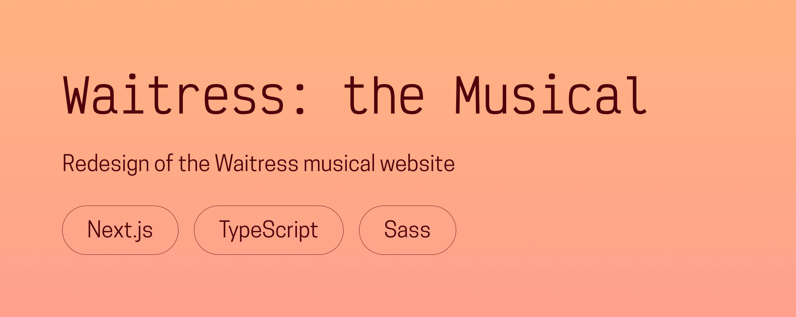

# 🥧 Waitress: The Musical

**A redesign of the official Waitress musical website, celebrating the show’s 10th anniversary tour.**  
Created in 2025 to reimagine the site’s structure, accessibility, and performance while preserving its charm.

---

## 🌟 Overview
This project reimagines the official **Waitress: the Musical** website with a focus on **accessibility, responsiveness, and performance**, all while maintaining the show’s warmth and playful identity.  

The redesign preserves the signature color palette and imagery, modernizes the layout, and improves the overall user experience.  
It also highlights promotional content like tour dates and cast photos through optimized visuals and smooth transitions.

Built with **Next.js**, **TypeScript**, and **Sass**, this project merges technical precision with design sensibility, bridging stage storytelling and interactive digital experiences.

---

## 🖥️ Live demo
👉 [**Visit Waitress: The Musical**](https://waitressmusical.chloeadrian.dev/)  

You can also see its dedicated project page on my [**portfolio**](https://chloeadrian.dev/en/project/waitress).

---

## ⚙️ Tech stack
- **Next.js** for structure, routing, and performance  
- **TypeScript** for type safety and maintainability  
- **Sass** for clean, organized styling  
- **Figma** for visual design and component layout  

---

## 🧠 Key features
- Redesigned responsive layout optimized for all devices  
- Accessible navigation and content hierarchy  
- Modernized visuals while preserving brand identity  
- Smooth transitions and subtle animations  
- Image optimization for faster load times  

---

## 🕊️ Reflection
This project highlights my ability to **merge design and development**, translating a strong existing brand into a refined, inclusive web experience.  
It also reflects my approach to performance and attention to detail, building something that feels theatrical, heartfelt, and fast.

---

Thanks for reading, and enjoy the show!  
Chloé Adrian ✨